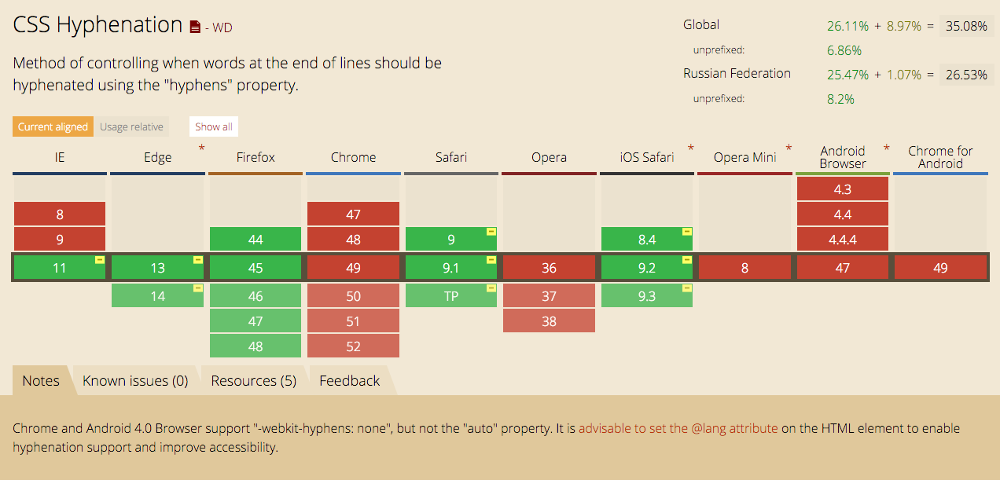
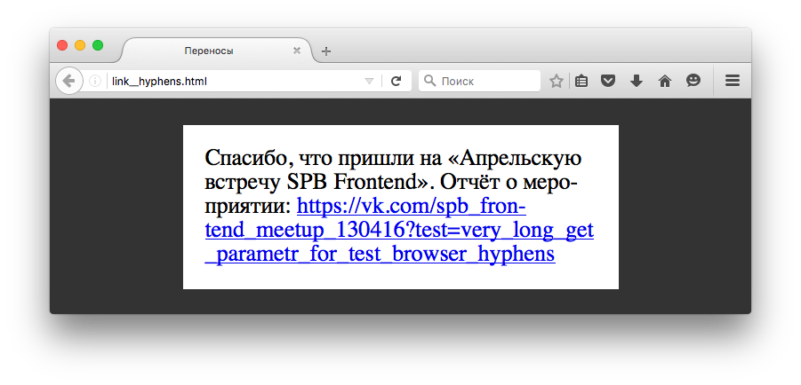
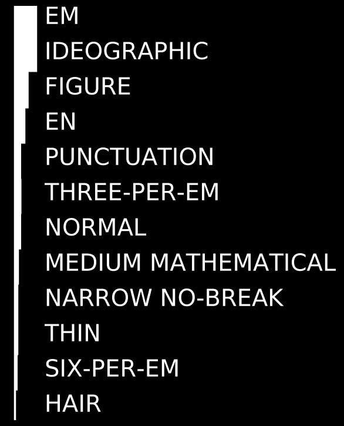
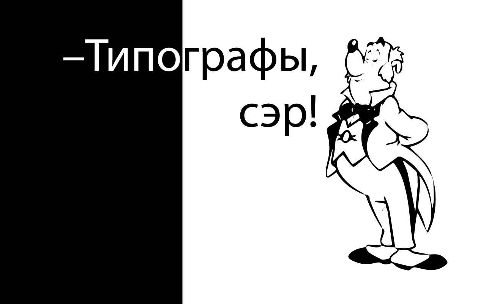

«„Утиные истории“ – не все поймут, но многие вспомнят…»
=======================================================

Скачать слайды презентации: https://github.com/Realetive/lecture-duck-tales/releases

План
----

- Рассказать об особенностях типографики (и её месте в вебе);
- привести примеры инструментов, решающих «проблемы» типографики;
- сказать: «Для этого есть плагин на PostCSS!»;
- показать практические примеры (и приёмы) оформления текста.

Вступление
----------

Мы ежедневно решаем проблемы пользователей, создаем новые интерфейсы, сеем «чистое, доброе, светлое» в мир веб-технологий. Мы используем самые современные инструменты и библиотеки, пишем тысячи строк кода, оптимизируем и _рефакторим_ их, но…

### Пользователю __плевать__ на наши трудности

Пользователь хочет «здесь» и «сейчас», ему нужен __контент__. «Контент» – это, в первую очередь, текст.

### «Текст — не наша работа!»,

скажете вы, и будете правы. Текст предоставляют контент-менеджеры, копирайтеры, дизайнеры макетов. Но если __это__ не сделаем мы, этого не сделает никто. Мы – __ФРОНТ__енд-разработчики, _последний бастион_ на защите пользователя.

- <del>Рассказать об особенностях типографики (и её месте в вебе);</del>

Типографика
-----------

Далеко ходить не надо: большинство вопросов оформления текста — школьная программа. Использование типографического набора там, где это необходимо – вполне посильная задача: правил не так много и они диктуются стандартами куда более древними, чем спецификации HTML или JavaScript.

Примеры типографических символов:

* __…__ — многоточие
* __«__ и __»__ _или_ __„__ и __“__ – кавычки
* __&minus;__ – минус
* __-__ – дефис
* __&ndash;__ – короткое тире
* __—__ – тире
* • – центральная точка
* ° – градус
* пробелы

### Переносы (2 класс)

#### Проблема

Наиболее распространённый пример острой необходимости в переносах – колонки с выравниванием по ширине.

#### Пример

|  |
| :----: |
| Скриншот сайта «МИТТЕК» с [Бизнес-линча студии Артемия Лебедева](http://www.artlebedev.ru/kovodstvo/business-lynch/2007/08/29/) |

|  |
| :----: |
| Комментарий Артемия Лебедева: «Так верстают только мудаки». |

#### Решение

__HTML__: когда использование стандартной _выключки_ по левому краю неприемлемо, исправить ситуацию может расстановка «мягких» `&shy;` переносов.

__CSS__: спецификация описывает автоматическую поддержку переносов браузерами:

```css
.column {
  hyphens: auto;
}
```

|  |
| :----: |
| Поддержка переносов браузерами по данным [caniuse.com](http://caniuse.com/#feat=css-hyphens) |

__JavaScript__: есть фолбэк – [Hyphenator.js](http://mnater.github.io/Hyphenator/).

#### Проблема

Перенос ссылок — длинные ссылки могут выходить за рамки блока:



__CSS__:

```css
.link {
  word-wrap: break-word;
  word-break: break-all;
  hyphens: auto;
}
```

### Пробелы

> https://habrahabr.ru/post/136348/

> https://habrahabr.ru/post/23250/

> http://prgssr.ru/development/vse-o-probelah.html

Существует больше десятка разновидностей пробелов [[wiki](https://en.wikipedia.org/wiki/Space_(punctuation)#Spaces_in_Unicode)]!



| Название пробела                  | HTML сущность  | Код юникода |
| :-------------------------------- | :------------- | :---------- |
| Em&#8195;space                    | `&#8195;`      | \u2003      |
| Ideographic&#12288;space          | `&#12288;`     | \u3000      |
| Figure&#8199;space                | `&#8199;`      | \u2007      |
| En&#8194;space                    | `&#8194;`      | \u2002      |
| Punctuation&#8200;space           | `&#8200;`      | \u2008      |
| Three-per-em&#8196;space          | `&#8196;`      | \u2004      |
| Normal&#32;space                  | `&#32;`        | \u0020      |
| No-break&#160;space               | `&#160;`       | \u00A0      |
| Mathematical&#8287;space          | `&#8287;`      | \u205F      |
| Four-per-em&#8197;space           | `&#8197;`      | \u2005      |
| Thin&#8201;space                  | `&#8201;`      | \u2009      |
| Six-per-em&#8198;space            | `&#8198;`      | \u2006      |
| Hair&#8202;space                  | `&#8202;`      | \u200A      |
| Narrow&#8239;no-break&#8239;space | `&#8239;`      | \u202F      |
| Zero-width​​&#8203;space            | `&#8203;`      | \u200B      |

__HTML__: есть тег `<nobr>неразрывный пробел</nobr>` — <del>deprecated</del> никогда не был частью стандарта

__CSS__: определяет отображение пробелов между словами.

```css
.nobr {
  white-space: normal | nowrap | pre | pre-line | pre-wrap | inherit;
}


```

### Числа

> https://habrahabr.ru/post/24544/

__CSS__: позволяет управлять использованием альтернативных начертаний для цифр, дробей и порядковых числительных:

```css
.numeric {
  font-variant-numeric: normal | [ <numeric-figure-values> || <numeric-spacing-values> || <numeric-fraction-values> || ordinal || slashed-zero ]
}
```

#### Оформление телефонных номеров

> Источник: https://www.artlebedev.ru/kovodstvo/sections/91/

Обычные городские номера

* 123-45-67
* 12-34-56
* 1-23-45
* 12-34

Номера с кодом города

* (123) 123-45-67
* (12-34) 12-34-56
* (123-45) 1-23-45
* (12-34-56) 12-34 54

Номера мобильных телефонов

* +7 123 123-45-67 (предпочтительнее)
* 8 123 123-45-67 55

Российские номера телефонов за рубежом

* +7 123 123-45-67
* +7 12-34 12-34-56
* +7 123-45 1-23-45
* +7 12-34-56 12-34
* (+7 123) 123-45-67
* (+7 12-34) 12-34-56
* (+7 123-45) 1-23-45
* (+7 12-34-56) 12-34

### Тире (5 класс)


### Кавычки (5 класс)

### Списки

Тут всё более-менее просто… В предложении перед списком ставится двоеточие, если оно является вводным к списку. Точка ставится, если предложение слабо связано с перечислением. Каждый элемент начинается со строчного символа и заканчивается _точкой с запятой_.

В нумерованных списках, элементы которых завершаются запятой или точкой с запятой, <del>должны</del> крайне желательно использование круглых скобок после номера.

Типографы
---------



### студии Артемия Лебедева

http://www.artlebedev.ru/tools/typograf/

### Муравьёва (PHP и Python)

http://mdash.ru/

### Антона Шувалова

http://a.github.io/textr/

### Дениса Селезнева

https://typograf.github.io/

### Максима Оранского и Александра Макарова (PHP)

http://rmcreative.ru/blog/post/tipograf

- <del>привести примеры инструментов, решающих «проблемы» типографики;</del>

Оформление
----------

### Ширина текстового блока

### Адаптивный кегль


@TODO: единицы измерения для текста.

* [postcss-responsive-type](https://github.com/seaneking/postcss-responsive-type) — часть пакета Rucksack;
* bower-пакет [Typographic](https://github.com/corysimmons/typographic) (SASS→PostCSS)

* <del>сказать: «Для этого есть плагин на PostCSS!»;</del>

### Полноширный заголовок


### Висячая пунктуация

> https://amplifr.com/ru используют висячую пунктуацию

### Подчёркивание ссылок


### Вертикальный ритм

> http://vithar.github.io/bem.info/ru/methodology/solved-problems/

> http://prgssr.ru/development/estetichnyj-sass-chast-3-tipografika-i-vertikalnyj-ritm.html

#### Инструменты:

> http://topfunky.com/baseline-rhythm-calculator/

> http://drewish.com/tools/vertical-rhythm

> http://toki-woki.net/p/Boks/

> http://baselinecss.com/

> https://github.com/markgoodyear/postcss-vertical-rhythm

> https://github.com/F21/postcss-vertical-rhythm-function

### Буквица

уквица — художественный приём оформления текста за счёт увеличенния первой буквы главы или раздела, базовая линия которой ниже на одну или несколько строк базовой линии основного текста. В рукописных книгах буквицы часто украшались миниатюрами и орнаментами, на смену которым пришли простые буквы в виде обычной литеры наборного шрифта, но увеличенного кегля.

__CSS__: как такового правила нет, но эффект без проблем достигается с помощью псевдоэлемента `::first-letter`:

```css
.initial-letter::first-letter {
  font-size    : 3em;     /* Размер буквицы */
  padding      : 3px;     /* Поля вокруг первой буквы */
  margin-right : 5px;     /* Отступ справа */
  color        : #e7685d; /* Цвет буквицы  */
  float        : left;    /* Обтекание по правому краю */
  line-height  : 0.33em;  /* Положение относительно текста */
}

.initial-letter {
  clear: left;
}
```

### КАПИТЕЛЬ

> КЁРНИНГ, ШРИФТЫ?<br>
  В П#%$У ЭТУ КАШУ!<br>
  СМОТРИТЕ, КАК ЛИХО<br>
  Я КАПИТЕЛЬЮ Е#%$У!

|  |
| :--: |
| Влади́мир Влади́мирович Маяко́вский — русский! Советский! Поэт! |

КАПИТЕЛЬ ≠ КАПС.

Начертание в гарнитуре, в которой строчные знаки выглядят как уменьшенные заглавные. Чтобы подчеркнуть разницу между капителью и строчными буквами, её делают немного выше строчных, а полуапроши капительных знаков увеличивают.

- <del>показать практические примеры (и приёмы) оформления текста.</del>

Заключение
----------

### Многоточие

Помимо типографического символа – __…__, приём сокрытия текста, не вошедшего в блок.

__CSS__: 

```css
.truncate {
  width: 250px;
  white-space: nowrap;
  overflow: hidden;
  text-overflow: ellipsis;
}
```

Но этот способ имеет один недостаток – он рассчитан на однострочный блок. Для многострочного блока есть:

* префиксное -webkit-свойство `-webkit-line-clamp : <integer>`
  * кроссбраузерное решение:

```scss
$line-height  : 1.2;
$block-height : 1em * $line-height;

@mixin line-clamp_line($line) {
  -webkit-line-clamp : $line;
  height             : calc($block-height * $line);
}

.line-clamp {
  display       : block;
  position      : relative;

  line-height   : $line-height;
  overflow      : hidden;
  text-overflow : ellipsis;
  padding       : 0;

  &:after {
    content    : '…';
    display    : block;
    position   : absolute;
    bottom     : 0;
    right      : 0;
    text-align : right;
    width      : 25%;
    height     : calc($block-height);
    background : linear-gradient(to right, rgba(255, 255, 255, 0), rgba(255, 255, 255, 1) 75%);
  }
}

@supports (-webkit-line-clamp: 1) {
  .line-clamp:after {
    display : none;
  }
}

.line-clamp_line_5 {
  @include line-clamp_line(5);
}
```

* решение на __JavaScript__: [Clamp.js](https://github.com/josephschmitt/Clamp.js), [jQuery.dotdotdot](https://github.com/FrDH/jQuery.dotdotdot) и др.

## Дополнительные материалы

* Главред и советы Бюро Артемия Горбунова + Электронный учебник «[Типографика и вёрстка](http://artgorbunov.ru/projects/book-typography/)»;
* TypoWolf – журнал c примерами типографических приёмов в вебе. Ежедневные подборки, статьи и руководства.
* [Gutenberg](https://github.com/matejlatin/Gutenberg) – настраиваемый типографический стартовый набор на Sass, основанный на вертикальном ритме.

### На «сладкое»

* ё-фикация текста: https://github.com/hcodes/eyo
* Яндекс.Спеллер: https://github.com/hcodes/yaspeller

## Вопросы? Жалобы? Предложения?

> bit.ly

## — От винта!

Спасибо за внимание, с вами был
Роман Ганин,

* @Realetive